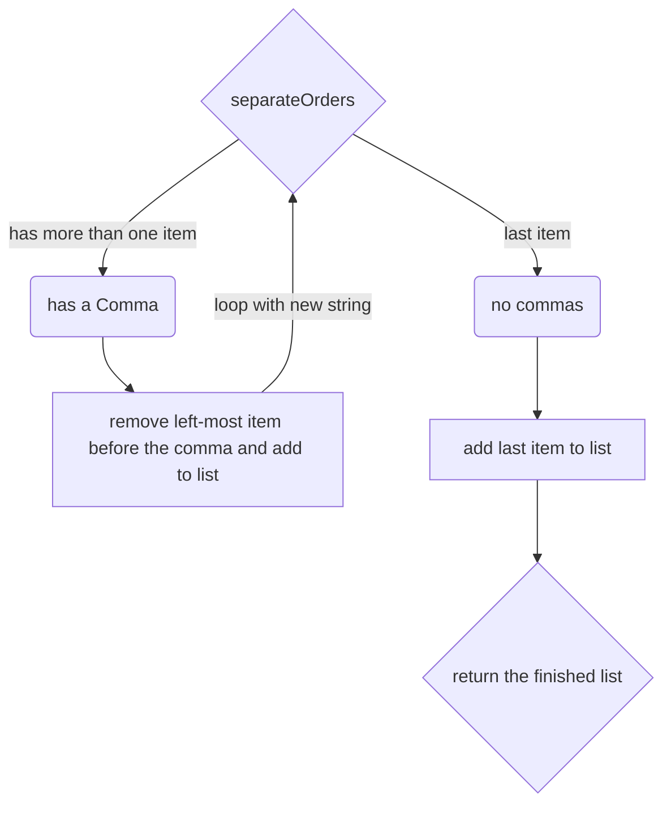

# Lab: PerfectionistPancakes
This lab contains question related to Recursion

# Attached is some code
Review the code provided. Answer the following questions by adding comments to your code! You are free to talk with other students, and seek better understanding to these questions. See below for reminders on types, variables, and input.

# Scenario
You have been hired as a new employee at a perfectionist-run cafe. The owners are very particular about how they like things organized, so they have decided to implement a robot to do some of the work for them. You are in charge of coding the robot. Attached is some of the code you have already written.

# Step 1
Complete the following questions in the comments at the top of your code. If your answer is multiple lines, use these: \``` around your answer:

1. Take a look at the flow diagram below. This is the flow diagram for separateOrders(str). On a piece of paper, or something separate, make a flow diagram for onePlateToAnother() and show it to a TA when you're done.
2. What is the output for onePlateToAnother(\[“blueberry”, “strawberry”, “choco chip”]?
3. What is the base case for onePlateToAnother(pancakes)?
4. What is the output for main() when this is the input?:
maple
Y
strawberry 
y 
birthday cake
n 
double chocolate




# Step 2: Coding orderUp(totalNum, orders)
Now it’s your turn! Write a function that takes in the initial number of orders and a list of orders (this will be a list of strings) and then RECURSIVELY adds each order to a string as: “Order #_, your order of _ pancakes is up!\n".

To break this function down into human actions, you start as a waiter. 
- You take the orders of a bunch of different customers and all of those orders are on your piece of paper: the orders parameter. 
- Now, you want to hand these orders off to the cook one at a time and you want to make them easier to read. Right now, your orders are written with every pancake the person ordered on one line, but you want to separate them into bullet points. 
- We can do this with the separateOrders() function. So, you'll want to make a new piece of paper (or variable) and separate the first order in your list of orders (or orders\[0\]). Now that you have the order nicely formatted, you can send it to the cook. 
- The cook (and you) must flip the pancakes upside down using onePlateToAnother() with the order you just gave them. 
- The cook will then hand the pancakes off to you, and you now must call out that the order is ready. 
- To get the order number, we want to subtract the number of orders left (or len(orders)) from totalNum, or the original number/length of orders you started with, and add 1 to the result. 
- Now we must add our recursion. You'll want to add another call to orderUp() and remove the order you just finished from the list of orders for your order parameter.
- Your base case should be when you have run out of orders to serve.

For Example, for 
```python
orderUp(3, [“blueberry, strawberry”, “plain, whole wheat”, “banana nut, birthday cake, chocolate chip”])
# the output would be:
# “Order #1, your order of [“strawberry”, “blueberry”] pancakes is up!”
# “Order #2, your order of [“whole wheat”, “plain”] pancakes is up!”
# “Order #3, your order of [“chocolate chip”, “birthday cake”, “banana nut”] pancakes is up!”
```
(Hint: there is already a function for turning strings into lists, and there is a function for reversing the pancakes)

# Step 3: Test orderUp(totalNum, orders)
How do you test code? You simply add the lines to your python file (in the future, you will have test lines in separate files).

As such, we would recommend adding the following just above def main().
```python
print("TESTING", orderUp(3, [“blueberry, strawberry”, “plain, whole wheat”, “banana nut, birthday cake, chocolate chip”]))
```
Also add your own tests!

# Submitting the Assignment
Make sure you run the code with no errors and then save the code. The Co-Investigators will then evaluate your code against the zybooks to get the final score once the experiment is done.

# Reminder on Lists
Think of lists as cubbies or drawers. Each entry in the list contains an item, and you can access them by using the number on the drawer, or the index of the entry. Technically, strings are lists of characters, so we can do things like substring our lists, as you will see in the example code, and it works the same way. You give it a range of indexes that you want to look at.

# Reminder on Using Functions Within Functions
If you are ever writing a function and you already have a function that does part of the work, just call that function in your function! For example, if I am writing a function called fact3(num) that finds the factorial of a number and multiplies it by 3 and I have a function called factorial(number) that gets the factorial, then I may write fact3(num) like this:
```python
def fact3(num):
   facto = factorial(num)
   return facto * 3
```
# Reminder on Recursion
This warmup uses pancake stacks to try to emulate the order of operations for recursion. When writing anything with recursion, it can help to write out what is happening or what your pancake stack looks like. Recursion works like making a stack fo pancakes and moving it from one plate to another. You stack up the pancakes on the first plate in order, in the same way that your code will stack up calls to the recursive function, until it reaches the last pancake, or the base case. Now you're done making pancakes and you can start moving them to the other plate--in your code, this is where the code will read the code that comes after the function call. However, if you're moving pancakes, you have to start with the top pancake or they might tear. WHich means you start with the LAST function call and work all the way back to the first time the function is called. 

# Reminder on Base Cases
A base case is the condition the code must meet in recursion to stop looping. Typically, this is a special if statement and if the if statement is false, it calls itself again. For example, with 
```python
def recurs(num):
    if num <= 0:
        return 1
    return num + recurs(num - 1)
```
The function will continue looping until num reaches 0.
